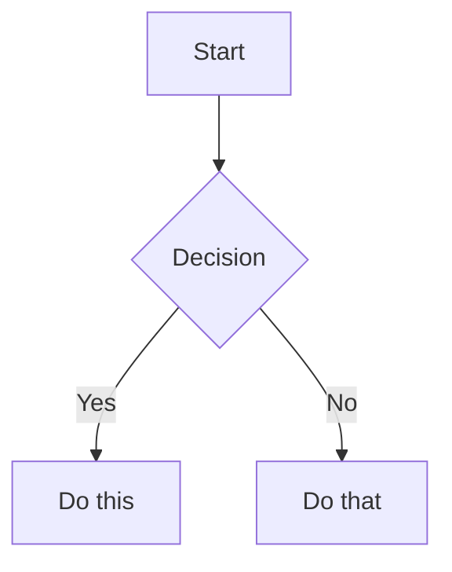

# Obsidian 风格 Markdown Skill

创建和编辑有效的 Obsidian 风格 Markdown。Obsidian 通过维基链接、嵌入、标注、属性、注释和其他语法扩展了 CommonMark 和 GFM。本 skill 仅涵盖 Obsidian 特有的扩展 —— 标准 Markdown（标题、加粗、斜体、列表、引用、代码块、表格）属于基础知识。

## 工作流：创建 Obsidian 笔记

1. **添加 frontmatter**，在文件顶部写入属性（标题、标签、别名）。所有属性类型请查看 [PROPERTIES.md](references/PROPERTIES.md)。
2. **编写内容**，使用标准 Markdown 构建结构，加上下方介绍的 Obsidian 特定语法。
3. **链接相关笔记**，使用维基链接（`[[Note]]`）连接仓库内的笔记，或使用标准 Markdown 链接指向外部 URL。
4. **嵌入内容**，使用 `![[embed]]` 语法从其他笔记、图片或 PDF 嵌入内容。所有嵌入类型请查看 [EMBEDS.md](references/EMBEDS.md)。
5. **添加标注**，使用 `> [!type]` 语法高亮信息。所有标注类型请查看 [CALLOUTS.md](references/CALLOUTS.md)。
6. **验证**，在 Obsidian 的阅读视图中确认笔记渲染正确。

> 在选择维基链接和 Markdown 链接时：仓库内的笔记使用 `[[维基链接]]`（Obsidian 会自动跟踪重命名），外部 URL 仅使用 `[文本](url)`。

## 内部链接（维基链接）

```markdown
[[Note Name]]                          链接到笔记
[[Note Name|Display Text]]             自定义显示文本
[[Note Name#Heading]]                  链接到标题
[[Note Name#^block-id]]                链接到块
[[#Heading in same note]]              同笔记标题链接
```

通过在段落末尾追加 `^block-id` 来定义块 ID：

```markdown
This paragraph can be linked to. ^my-block-id
```

对于列表和引用，将块 ID 放在块后的单独一行：

```markdown
> A quote block

^quote-id
```

## 嵌入

在任意维基链接前加 `!` 即可内嵌其内容：

```markdown
![[Note Name]]                         嵌入完整笔记
![[Note Name#Heading]]                 嵌入章节
![[image.png]]                         嵌入图片
![[image.png|300]]                     指定宽度嵌入图片
![[document.pdf#page=3]]               嵌入 PDF 页面
```

音频、视频、搜索嵌入和外部图片的详细信息请查看 [EMBEDS.md](references/EMBEDS.md)。

## 标注

```markdown
> [!note]
> 基础标注。

> [!warning] 自定义标题
> 带自定义标题的标注。

> [!faq]- 默认折叠
> 可折叠标注（- 折叠，+ 展开）。
```

常见类型：`note`、`tip`、`warning`、`info`、`example`、`quote`、`bug`、`danger`、`success`、`failure`、`question`、`abstract`、`todo`。

完整列表（含别名、嵌套和自定义 CSS 标注）请查看 [CALLOUTS.md](references/CALLOUTS.md)。

## 属性（Frontmatter）

```yaml
---
title: My Note
date: 2024-01-15
tags:
  - project
  - active
aliases:
  - Alternative Name
cssclasses:
  - custom-class
---
```

默认属性：`tags`（可搜索的标签）、`aliases`（链接建议的替代笔记名称）、`cssclasses`（样式 CSS 类）。

所有属性类型、标签语法规则和高级用法请查看 [PROPERTIES.md](references/PROPERTIES.md)。

## 标签

```markdown
#tag                    行内标签
#nested/tag             带层级的嵌套标签
```

标签可包含字母、数字（不能作为首字符）、下划线、连字符和斜杠。标签也可以在 frontmatter 的 `tags` 属性下定义。

## 注释

```markdown
This is visible %%but this is hidden%% text.

%%
This entire block is hidden in reading view.
%%
```

## Obsidian 特定格式

```markdown
==Highlighted text==                   高亮语法
```

## 数学（LaTeX）

```markdown
Inline: $e^{i\pi} + 1 = 0$

Block:
$$
\frac{a}{b} = c
$$
```

## 图表（Mermaid）

````markdown

````

要将 Mermaid 节点链接到 Obsidian 笔记，添加 `class NodeName internal-link;`。

## 脚注

```markdown
Text with a footnote[^1].

[^1]: Footnote content.

Inline footnote.^[This is inline.]
```

## 完整示例

````markdown
---
title: Project Alpha
date: 2024-01-15
tags:
  - project
  - active
status: in-progress
---

# Project Alpha

This project aims to [[improve workflow]] using modern techniques.

> [!important] Key Deadline
> The first milestone is due on ==January 30th==.

## Tasks

- [x] Initial planning
- [ ] Development phase
  - [ ] Backend implementation
  - [ ] Frontend design

## Notes

The algorithm uses $O(n \log n)$ sorting. See [[Algorithm Notes#Sorting]] for details.

![[Architecture Diagram.png|600]]

Reviewed in [[Meeting Notes 2024-01-10#Decisions]].
````

## 参考资料

- [Obsidian 风格 Markdown](https://help.obsidian.md/obsidian-flavored-markdown)
- [内部链接](https://help.obsidian.md/links)
- [嵌入文件](https://help.obsidian.md/embeds)
- [标注](https://help.obsidian.md/callouts)
- [属性](https://help.obsidian.md/properties)
