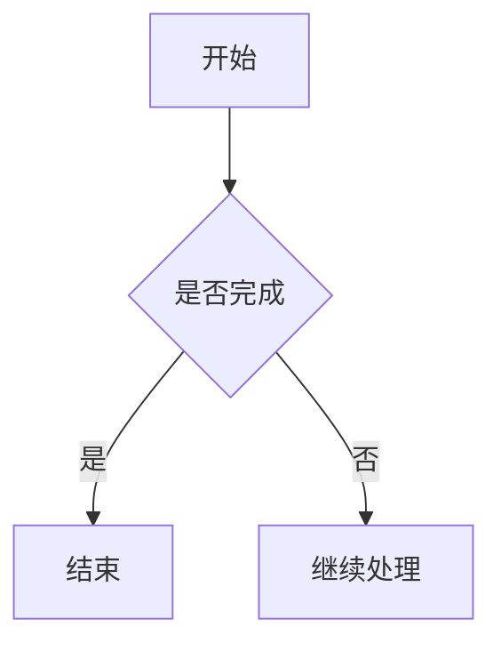

# 一、Obsidian 概述

## 1、简介
Obsidian 是一款以本地 Markdown 文件为基础的知识管理与笔记应用，由 Erica Xu 和 Shida Li 创立，并于 2020 年首次推出。它不把笔记封闭在专有数据库中，而是直接读取和管理本地文件夹中的 `.md` 文件。

在 Obsidian 中，一个用于保存笔记、附件和配置的文件夹称为仓库（Vault）。仓库中的内容仍然是普通文件，可以使用文件管理器、文本编辑器或其他 Markdown 工具打开。

Obsidian 主要有三个特点：

- **本地文件** ：笔记使用 Markdown 格式保存，并通过文件和文件夹组织
- **双向链接** ：既能看到当前笔记链接了哪些内容，也能看到哪些笔记正在引用当前笔记
- **高度可扩展** ：可以通过核心插件、社区插件、主题和 CSS 片段扩展功能与外观

这些能力让 Obsidian 既可以作为简单的 Markdown 编辑器，也可以逐步发展为个人知识库。不过，可选插件和工作流非常多，初学时不必急于配置完整系统。

> [!tip]
> 先完成安装、创建仓库并开始记录，再根据实际需求增加插件和调整结构。一个能持续使用的简单系统，通常比一次性搭建复杂系统更有效。

## 2、跨平台支持
Obsidian 支持 Windows、macOS、Linux、iOS、iPadOS 和 Android。各平台版本可以从 [Obsidian 下载页面](https://obsidian.md/download) 获取。由于笔记以本地文件保存，即使离线也可以正常阅读和编辑。

## 3、费用与同步
Obsidian 应用本身可以免费用于个人、商业、教育、非营利等用途，也不要求注册账号。Catalyst 和 Commercial 许可证属于自愿支持项目，不是使用 Obsidian 的必要条件。

Obsidian Sync 是可选的付费同步服务，用于在桌面端和移动端之间同步仓库，提供端到端加密、版本历史等功能。它不是使用 Obsidian 的前提；也可以根据设备和系统选择 iCloud、OneDrive、Git 等其他同步方案。

> [!warning]
> 同步不能代替备份。无论使用哪种同步方案，都建议另外保留独立备份，并避免在多个同步工具中同时管理同一仓库。

## 4、Markdown 与数据可迁移性
Obsidian 使用 Markdown 纯文本文件构建知识库。Markdown 文件具有以下优势：

- 不依赖 Obsidian 也能搜索、阅读和编辑
- 可以使用 Git 进行版本管理
- 便于在 Windows、macOS 和 Linux 之间迁移
- 相比专有格式，更容易长期保存并迁移到其他工具

Obsidian 在标准 Markdown 基础上还支持双向链接、内容嵌入、Callout、属性等扩展语法，详见 [[2、Obsidian 扩展语法|Obsidian 扩展语法]]。

本笔记只介绍建立并运行基础笔记系统所需的操作。熟悉基本流程后，再逐步探索插件、主题和自动化功能。

## 5、定位

Obsidian 首先是一个码字工具，但更重要的是，它是一个深度的知识管理工具：

- 内容为基础
- 链接为核心

通过建立知识库，来关联知识点，同时发现新知识点。

时刻记住，Obsidian 不是单纯的信息收集工具，否则它不是你的第二大脑，而是第二垃圾桶！

# 二、安装 Obsidian

访问 [Obsidian 官方下载页面](https://obsidian.md/download)，根据当前设备选择对应的平台版本，然后按照安装向导完成安装。


# 三、创建与选择仓库

## 1、创建仓库

首次启动 Obsidian 后，可以创建一个新仓库，或打开已有的本地文件夹作为仓库。如下图所示：

![[assets/Pasted image 20260707004937.png|300]]

对于第一次使用 Obsidian 的用户，建议先创建一个新仓库。选择一个容易找到且会定期备份的位置，并使用能够清楚表达用途的名称。

> [!warning]
> 不要直接把整个用户目录、桌面或文档目录作为仓库。仓库范围过大会让无关文件进入索引，也会使附件和配置更难管理。

Obsidian 既支持把所有笔记保存在一个仓库中，也支持创建多个相互独立的仓库：

- 单一仓库：便于跨主题搜索、建立链接和统一管理，适合个人知识库
- 多个仓库：适合需要严格隔离的工作、团队或隐私场景

打开仓库后，通常界面如下：

![[assets/Pasted image 20260707012022.png|600]]


## 2、认识 Obsidian 界面

上图展示了 Obsidian 的典型桌面布局。整个界面由功能区、侧边栏、工作区、标签页和状态栏组成，各区域可以根据需要折叠、调整宽度或重新排列。

### （1）功能区

窗口最左侧的竖向图标栏称为功能区（Ribbon），用于快速打开常用命令。这些命令可能来自 Obsidian 默认功能、核心插件，也可能来自第三方插件。

在桌面端，功能区位于左侧边栏。

![[assets/Pasted image 20260708001558.png|200]]

功能区中的每个图标都代表一个命令。鼠标悬停在图标上会显示提示，点击图标即可执行对应命令。例如，点击关系图谱图标，就会打开关系图谱：

![[assets/Pasted image 20260708001747.png|600]]

功能区底部默认有三个基础命令：

| 命令     | 作用                  |
| ------ | ------------------- |
| 打开另一个库 | 切换或打开其他 Obsidian 仓库 |
| 帮助     | 访问 Obsidian 帮助文档    |
| 设置     | 打开 Obsidian 设置      |
功能区可以自定义，设置结果会保存到 `.obsidian/workspace.json` 文件中。

桌面端常用操作：

- 拖放图标，调整命令顺序。
- 右键点击功能区空白处，取消勾选不需要显示的命令。

### （2）左侧边栏

左侧边栏主要用于浏览和管理仓库内容。截图中打开的是文件列表，只包含一篇“欢迎”笔记。文件列表顶部提供新建笔记、新建文件夹、排序和折叠等操作。

左侧边栏还可以切换到搜索、书签等面板。面板可以折叠，为中间工作区留出更多空间。

### （3）中间工作区

中间区域是主要工作区，用于阅读和编辑笔记。截图中打开的是 Obsidian 自动创建的“欢迎”笔记。

工作区顶部是标签栏。每篇打开的笔记或视图都会占用一个标签页；使用标签右侧的 `+` 可以新建标签页。标签页可以拖动排序，也可以拆分到不同窗格中并排显示。

### （4）右侧工作区与侧边栏

截图右侧打开了“关系图谱”视图，显示“欢迎”和“创建链接”两个节点之间的连接。这说明 Obsidian 的工作区不仅能显示笔记，也能显示关系图谱、Canvas、Bases 等其他视图。

常规使用中，右侧区域也经常作为侧边栏，用于显示当前笔记的反向链接、出链、标签、属性和大纲。具体显示内容取决于用户的布局设置。

### （5）工具栏与状态栏

每个窗格上方都有工具栏，可以执行前进、后退、切换视图和打开更多操作等命令。不同视图显示的按钮可能不同。

窗口底部是状态栏。截图右下角显示了反向链接数量、字数和字符数等信息，插件也可以在状态栏中增加自己的状态或快捷入口。

> [!tip]
> Obsidian 的界面布局可以自由调整。可以拖动标签页创建分栏，也可以折叠左右侧边栏。应用通常会保存当前工作区布局，下次启动时恢复到上次使用的状态。

# 四、基础设置

## 1、语言设置
进入 Obsidian 后，点击左下角的 **设置** 按钮。也可以使用快捷键<kbd>Command</kbd> + <kbd>,</kbd>（macOS）或<kbd>Ctrl</kbd> + <kbd>,</kbd>（Windows）。

![[assets/Pasted image 20260621220748.png|600]]

进入设置中的“关于”页面：

![[assets/Pasted image 20260621220840.png]]

在 **关于 → 语言** 中，将界面语言切换为 **简体中文** 。

## 2、设置始终更新内部链接
在 **设置 → 文件与链接** 中，开启 **始终更新内部链接** 。

开启后，当被引用的笔记发生重命名或移动时，Obsidian 会自动更新链接，减少手动维护链接的成本。

![[assets/Pasted image 20260621221403.png|600]]


## 3、附件存储路径
为了统一管理图片、PDF 等附件资源，建议为附件指定固定目录。

在 **设置 → 文件与链接 → 附件默认存放路径** 中，选择 **指定的附件文件夹** ，然后在 **附件文件夹路径** 中填写用于存放附件的目录。例如，这里使用 `assets`，之后附件都会保存到当前仓库的 `assets` 目录下。

![[assets/Pasted image 20260621223046.png]]

## 4、设置主题
在 **设置 → 外观 → 主题** 中，可以选择适合自己的主题：

![[assets/Pasted image 20260622005701.png]]

例如，这里下载并使用了 `Things` 主题。

## 5、快速调整字体大小

在 **设置 → 外观 → 字体** 中，可以调整字体大小：

![[assets/Pasted image 20260710003120.png|600]]

为了使用起来更方便，可以启用快速调整字体大小，之后就可以通过<kbd>Ctrl</kbd> + 鼠标滚轮放大或缩小字体了。

## 6、命令面板

命令面板是 Obsidian 的统一命令入口。它集中列出当前可用的操作，包括 Obsidian 内置功能、核心插件命令以及社区插件提供的命令。许多不容易在界面中找到的功能，都可以通过命令面板快速执行。

使用 <kbd>Command</kbd> + <kbd>P</kbd>（macOS）或 <kbd>Ctrl</kbd> + <kbd>P</kbd>（Windows）可以快速打开命令面板：

![[assets/Pasted image 20260621223141.png|400]]

打开后直接输入关键词，命令列表会随输入内容自动筛选。使用方向键选择命令，按 <kbd>Enter</kbd> 执行；按 <kbd>Esc</kbd> 关闭命令面板。

常见用途包括：

- 创建新笔记或打开设置
- 插入表格、模板等内容
- 切换编辑视图和阅读视图
- 显示属性、反向链接或关系图
- 执行插件提供的命令

> [!tip]
> 如果某个操作经常使用，可以在“设置 → 快捷键”中搜索对应命令并为它设置专属快捷键，不必每次都打开命令面板。

## 7、笔记属性

笔记属性（Properties）是用于描述笔记的结构化元数据，例如标题、创建日期、标签、状态和别名。属性通常显示在笔记顶部，但不属于正文内容，可以用于搜索、筛选、排序以及构建 Obsidian Bases 等数据视图。

一条属性由属性名称和属性值组成。例如，`status: in-progress` 表示属性名称为 `status`，属性值为 `in-progress`。

Obsidian 的属性界面可以理解为 YAML Frontmatter （关于 YAML 语法参考[[4、YAML|YAML]]）的可视化编辑器：在界面中添加、修改、删除属性时，底层 `.md` 文件顶部的 YAML 内容也会同步变化；切换到源码模式时，可以直接看到这些原始字段。

Obsidian 对部分属性有内置识别：

| 属性 | 作用 |
| --- | --- |
| `tags` | 定义笔记标签，会被标签面板识别 |
| `aliases` | 定义笔记别名，方便搜索和内部链接补全 |
| `cssclasses` | 为当前笔记应用自定义 CSS 样式类 |

具体的创建方式、属性列表面板和常见字段示例，见 [[3、Obsidian 插件#20、属性列表|属性列表]]。

## 8、实时预览

在**设置 -> 编辑器 -> 默认编辑模式**中，开启实时预览。此功能可以让我们在编辑笔记时实时看到 Markdown 渲染的效果。与之对应的就是源码模式，呈现的就是 Markdown 语法的格式，有关 Markdown 语法参考 [[3、Markdown|Markdown 基础]]。

![[assets/Pasted image 20260710003527.png|600]]

在笔记区域的右上角，还可以切换编辑视图和阅读视图：

![[assets/Pasted image 20260710003957.png|600]]

- 编辑视图：可编辑笔记，由于配置的实时预览，所见即所得
- 阅读视图：无法编辑，只能查看笔记内容

## 9、删除文件配置

在**设置 -> 文件与链接 -> 回收站**中，可以找到关于删除文件的配置。

![[assets/Pasted image 20260707235047.png|500]]

主要有三个选项：

| 选项                      | 含义                        |
| ----------------------- | ------------------------- |
| 移至系统回收站                 | 删除后进入系统回收站，可以从系统回收站恢复     |
| 移至 Obsidian 回收站（.trash） | 删除后移动到当前仓库里的 `.trash` 文件夹 |
| 永久删除                    | 直接删除，不进回收站，风险最高           |


# 五、开始记录与组织笔记

新仓库刚创建时通常是空的。无需在开始写作前设计完整的目录体系，可以先创建少量文件夹和笔记，再根据内容增长逐步调整结构。

## 1、创建文件夹

文件夹用于按项目、主题或资料类型组织笔记。创建文件夹的方法：

1. 在左侧文件列表顶部点击“新建文件夹”按钮。
2. 输入文件夹名称并按 <kbd>Enter</kbd>。
3. 在文件夹中创建新笔记，或将已有笔记拖入文件夹。

文件夹默认按照名称排序。命名应简短、清晰，并保持相同层级的命名方式一致。

> [!tip]
> 文件夹只是组织方式之一。Obsidian 还可以使用内部链接、反向链接、标签和属性组织内容。初学时不要建立过深的目录层级，两到三级通常已经足够。

## 2、创建第一篇笔记

可以使用以下方式创建笔记：

- 按 <kbd>Command</kbd> + <kbd>N</kbd>（macOS）或 <kbd>Ctrl</kbd> + <kbd>N</kbd>（Windows）
- 点击左侧文件列表顶部的“新建笔记”按钮
- 通过命令面板执行“新建笔记”命令

创建后，为笔记输入能够概括内容的名称，然后使用 Markdown 编写正文。笔记会以 `.md` 文件保存在当前仓库中。

一篇基础笔记可以包含：

- 标题和正文段落
- 有序列表或无序列表
- 代码块、表格和引用
- 标签和笔记属性
- 指向其他笔记的内部链接

## 3、整理和移动笔记

在左侧文件列表中按住笔记名称并拖动，可以将笔记移动到其他文件夹。也可以通过笔记菜单执行重命名、移动或删除操作。

如果已经开启“始终更新内部链接”，重命名或移动笔记时，Obsidian 会自动更新指向该笔记的内部链接。

整理时可以遵循以下原则：

- 先记录内容，再决定它最适合放在哪里
- 同一主题的笔记使用一致的命名方式
- 避免创建只有一篇笔记的多层文件夹
- 定期处理名称含糊、重复或长期未整理的笔记

## 4、使用内部链接连接笔记

内部链接用于表达笔记之间的关系。在编辑器中输入 `[[`，继续输入目标笔记名称，然后从候选列表中选择对应笔记：

```markdown
[[目标笔记]]
[[目标笔记|显示文本]]
```

链接建立后：

- 当前笔记会产生一条指向目标笔记的出链
- 目标笔记的反向链接中会显示当前笔记
- 启用“页面预览”核心插件后，鼠标悬停在链接上可以预览目标内容

如果目标笔记尚不存在，也可以先创建链接，之后再补充对应内容。标题链接、块链接和内容嵌入等语法详见 [[2、Obsidian 扩展语法#三、双向链接|Obsidian 双向链接]]。

> [!note]
> 文件夹表示笔记存放在哪里，内部链接表示笔记之间有什么关系。两者可以配合使用，不必二选一。

## 5、搜索笔记

当仓库中的内容逐渐增多时，可以使用左侧边栏的“搜索”功能查找笔记。搜索既可以匹配文件名，也可以匹配正文内容，是从小仓库过渡到中大型仓库时最常用的检索入口。

搜索面板的具体用法、常见搜索条件和组合示例，见 [[3、Obsidian 插件#22、搜索|搜索插件]]。


## 6、笔记别名

一篇笔记在不同语境中可能有不同名称，这些名称就是笔记别名。比如“人工智能”可以简称为“AI”，外文概念也可以用中文名、英文名或缩写共同指向同一篇笔记。

### （1）设置别名

别名写在笔记开头的 YAML frontmatter 中，字段名必须使用英文 `aliases`。例如，“人工智能”这篇笔记的顶部写：

```yaml
---
aliases: [AI, Artificial Intelligence]
---
```

Frontmatter 必须放在整篇笔记最开头，否则 Obsidian 不会识别。

### （2）使用别名链接

设置别名后，可以直接输入 `[[别名]]` 搜索并链接到原笔记。插入后，Obsidian 会自动生成带显示文本的链接：

```markdown
[[笔记原名称|别名]]
```

这样既能显示别名，又能明确指向原笔记。

### （3）反向链接与别名

设置别名后，其他笔记中提到原标题或别名的内容，都会出现在该笔记的“反向链接列表”中。

如下图所示，第一篇笔记和第二篇笔记内容分别出现了 AI 和人工智能，它们都出现在当前人工智能笔记的反向链接列表中（即使只是普通文本，还不是链接）。

![[assets/Pasted image 20260708000914.png|600]]

点击“转为内部链接”后，对应笔记的普通文本会被替换为链接：


![[assets/Pasted image 20260708001017.png|600]]

此时，第二篇笔记中的 AI 普通文本会变成链接：

```markdown
[[人工智能|AI]]
```

## 7、标签页

Obsidian 的标签页和浏览器标签页很像，用来在同一个窗口里同时打开多篇笔记或多个功能页。

常用操作也和浏览器接近，比如新建标签页、关闭当前标签页、撤销关闭的标签页、切换标签页等。这些快捷键都可以在 **设置 -> 快捷键** 中查看和修改。

![[assets/Pasted image 20260708003440.png|600]]

Obsidian 中，每个标签页都属于一个标签组。你可以拖动标签页来调整顺序，也可以把标签页拖到另一个标签组中。如下图所示，因为拖放，现在有两个标签组。

![[assets/Pasted image 20260708004235.png|600]]

如果把标签页拖到当前标签组的边缘，Obsidian 会高亮显示可放置区域。松开后，就可以把当前区域拆分成左右或上下两个标签组。

在桌面端，可以把标签页拖出当前窗口，让它在新窗口中打开。也可以把标签页拖到另一个已有窗口中。

右键点击标签页，可以选择“锁定”。锁定后，这个标签页中的链接会在新标签页中打开，不会直接替换当前页面。

如果想取消锁定，再次右键点击标签页，选择“取消锁定”即可。

标签组也可以切换为“堆叠标签页”显示方式。点击标签组右上角的下拉按钮，选择“堆叠标签页”即可。

![[assets/Pasted image 20260708004316.png|600]]

当同一个标签组里打开了很多笔记时，堆叠标签页可以减少横向空间占用，让工作区更紧凑。

## 8、脑图和流程图

不需要任何设置，Obsidian 天然支持 Mermaid 语法，可以直接在笔记中画流程图、时序图、甘特图、饼图等。如果需要更复杂的脑图体验，也可以另外安装脑图类插件。

Mermaid 的写法是使用 `mermaid` 代码块：

````markdown

````


其中 `graph TD` 表示从上到下绘制流程图。如果想横向展示，可以改成 `graph LR`：

````markdown

````


常见方向：

| 写法 | 含义 |
| --- | --- |
| `graph TD` | 从上到下 |
| `graph LR` | 从左到右 |

Mermaid 不只适合画流程图，也可以画：

| 类型 | 适合场景 |
| --- | --- |
| 流程图 | 步骤、判断、分支流程 |
| 时序图 | 角色之间的交互顺序 |
| 甘特图 | 项目计划和时间安排 |
| 饼图 | 简单比例关系 |
| 类图 | 对象、类型、继承关系 |

对日常笔记来说，最常用的是流程图。只要记住节点、箭头和方向即可，不需要一开始掌握所有 Mermaid 语法。

# 六、使用插件扩展 Obsidian

插件用于为 Obsidian 增加或调整功能。Obsidian 的插件分为核心插件和社区插件：核心插件由官方提供，社区插件由第三方开发者提供。

对初学者来说，插件不应该一开始就成为重点。更稳妥的顺序是：先掌握 Markdown 写作、内部链接、搜索、标签和基础设置，再根据真实需求补充插件。

## 1、核心插件

核心插件随 Obsidian 一起安装，不需要额外下载。常见核心插件包括关系图谱、反向链接、日记、模板、页面预览、标签列表、文件恢复和命令面板等。

启用核心插件：

1. 打开 **设置** 。
2. 进入 **核心插件** 。
3. 搜索需要的插件并打开右侧开关。

## 2、社区插件

社区插件可以扩展 Obsidian 原本没有的功能，例如增强编辑、导出文档、显示最近文件、统计笔记数量、调整主题样式或连接外部服务。

安装社区插件：

1. 打开 **设置 → 社区插件** 。
2. 关闭安全模式，开启社区插件功能。
3. 点击 **浏览** ，进入社区插件市场。
4. 搜索并打开需要的插件。
5. 点击 **安装** ，安装完成后再点击 **启用** 。

> [!note]
> 社区插件会运行第三方代码。安装前应查看插件说明、开发者、更新时间和使用人数，只安装确实需要的插件。

核心插件、社区插件的详细安装方式、使用入口、选择原则和简单插件示例，见 [[3、Obsidian 插件|Obsidian 插件]]。
