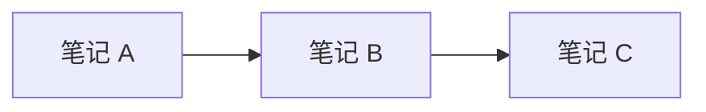

# 一、概述

学习 Obsidian 语法前，需要先学习 [[3、Markdown|标准 Markdown 语法]]。

Obsidian 在标准 Markdown 基础上增加了属性、维基链接、内容嵌入、Callout、块链接等语法，用于组织笔记之间的关系并增强阅读体验。

> [!note]
> 本文主要介绍 Obsidian 原生支持的语法。HTML、CSS 片段和社区插件提供的能力会单独标注，避免与原生功能混淆。

# 二、属性

属性位于文件顶部，使用 YAML frontmatter 编写：

```yaml
---
title: 示例笔记
date: 2026-07-07
tags:
  - obsidian
  - markdown
aliases:
  - 示例别名
status: in-progress
related: "[[相关笔记]]"
---
```

常用属性：

| 属性 | 作用 |
| --- | --- |
| `title` | 笔记标题 |
| `date` | 创建或更新日期 |
| `tags` | 标签列表 |
| `aliases` | 笔记别名，用于链接建议 |
| `cssclasses` | 为笔记应用 CSS 类 |

属性值可以是文本、数字、复选框、日期、日期时间、列表或内部链接。内部链接需要使用引号包裹，例如 `related: "[[Markdown]]"`。

# 三、双向链接

内部链接是 Obsidian 知识网络的基础。普通超链接只记录“当前页面指向哪里”，Obsidian 还会自动记录“哪些页面指向当前页面”，由此形成 **双向链接** 。

例如，在“笔记 A”中写入：

```markdown
[[笔记 B]]
```

此时会同时形成两种关系：

- **出链（Outgoing link）** ：笔记 A 指向笔记 B
- **入链（Backlink）** ：也称反向链接，笔记 B 可以看到笔记 A 正在引用自己

不需要在笔记 B 中手动添加返回链接。Obsidian 会根据仓库中的链接自动维护反向关系，并将其显示在“反向链接”面板中。

> [!tip]
> 双向链接的价值不只是方便跳转，而是让一篇笔记自动获得上下文：它引用了什么，以及它被哪些内容引用。

## 1、链接笔记与标题

```markdown
[[笔记名称]]
[[笔记名称|显示文本]]
[[笔记名称#标题]]
[[笔记名称#标题|显示文本]]
[[#当前笔记中的标题]]
```

输入 `[[` 后，Obsidian 会显示可链接的笔记和标题。

如果目标笔记尚不存在，链接仍然可以创建。点击链接后，Obsidian 会新建对应笔记。这类链接通常显示为较暗的颜色，用于表达“准备补充的概念”。

## 2、查看双向链接

打开一篇笔记后，可以通过“反向链接”面板查看引用当前笔记的其他页面。反向链接通常分为：

- **已链接提及** ：其他笔记已经使用 `[[当前笔记]]` 建立链接
- **未链接提及** ：其他笔记出现了当前笔记的名称，但尚未建立链接

未链接提及可以快速转换为正式链接。它适合发现遗漏的关联，但名称相同不一定代表同一概念，转换前需要确认语义。

双向链接也会用于：

- 局部关系图和全局关系图
- 出链与反向链接面板
- 链接笔记的重命名与路径更新
- 根据链接关系组织 MOC、主题索引和知识脉络

> [!note]
> 在“设置 → 文件与链接”中开启“始终更新内部链接”后，重命名或移动笔记时，Obsidian 会自动更新指向它的链接。

如果想查看全局关系图，也就是关系图谱，点击功能区的图谱按钮：

![[assets/Pasted image 20260710022032.png|600]]

就可以看到所有笔记的链接关系了：

![[assets/Pasted image 20260710022107.png|600]]

如果想看局部关系图，打开一篇笔记，点击右上角 `...`，选择 **打开当前笔记的局部关系图** ：

![[assets/Pasted image 20260710022208.png|600]]

会看到与这篇笔记相关的局部关系图谱：

![[assets/Pasted image 20260710022333.png|600]]

## 3、链接文本块

在段落末尾添加块 ID。正文与 `^block-id` 之间必须保留一个空格，并在该行之后插入空行结束段落：

```markdown
这段内容可以被其他位置直接引用。 ^block-id

这是下一个段落。
```

块 ID 的命名规则：

- 只能包含拉丁字母、数字和连字符 `-`
- 不能包含中文、空格或下划线 `_`
- 必须在当前笔记中保持唯一
- `^` 是块标识符的前缀，不属于 ID 名称本身

例如，`^installation-steps`、`^database-index-01` 和 `^37066d` 都是有效写法。

> [!warning]
> `段落1^block-id` 无法被正确识别，因为正文与 `^` 之间没有空格。

随后可以链接该文本块：

```markdown
[[笔记名称#^block-id]]
[[笔记名称#^block-id|显示文本]]
```

列表、引用、Callout 和表格等结构化内容的块 ID 应单独占一行，并在前后保留空行：

```markdown
- 第一项
- 第二项

^list-id

下一段内容。
```

同一笔记内可以省略笔记名称：

```markdown
[[#^block-id]]
[[#^block-id|显示文本]]
```

标题链接适合引用稳定章节，块链接适合精确引用某个段落或列表。块 ID 应使用简短、有意义的名称并保持稳定，避免频繁修改导致链接失效。

# 四、嵌入内容

在内部链接前添加 `!`，可以把目标内容直接显示在当前笔记中。

## 1、嵌入笔记

```markdown
![[笔记名称]]
![[笔记名称#标题]]
![[笔记名称#^block-id]]
```

嵌入内容仍然保存在原笔记中；修改原文后，所有嵌入位置会同步更新。

## 2、嵌入图片

```markdown
![[assets/image.png]]
![[assets/image.png|300]]
![[assets/image.png|640x480]]
```

- `300`：指定宽度并保持宽高比
- `640x480`：指定宽度和高度

外部图片使用标准 Markdown 语法：

```markdown


```

## 3、嵌入音频与 PDF

```markdown
![[audio.mp3]]
![[audio.ogg]]
![[document.pdf]]
![[document.pdf#page=3]]
![[document.pdf#height=400]]
```

## 4、嵌入搜索结果

使用 `query` 代码块可以动态显示搜索结果：

````markdown
```query
tag:#obsidian path:notes
```
````

# 五、Callout

Callout 用于突出提示、警告、示例等信息，其语法建立在块引用之上。

## 1、基本语法

```markdown
> [!note]
> 这是 Callout 内容。

> [!warning] 自定义标题
> 这里是警告内容。

> [!tip] 仅显示标题
```

常用类型：

| 类型 | 常见别名 | 用途 |
| --- | --- | --- |
| `note` | — | 普通说明 |
| `abstract` | `summary`、`tldr` | 摘要 |
| `info` | — | 信息 |
| `todo` | — | 待办事项 |
| `tip` | `hint`、`important` | 技巧或重点 |
| `success` | `check`、`done` | 成功或完成 |
| `question` | `help`、`faq` | 问题 |
| `warning` | `caution`、`attention` | 警告 |
| `failure` | `fail`、`missing` | 失败或缺失 |
| `danger` | `error` | 危险或错误 |
| `bug` | — | 缺陷 |
| `example` | — | 示例 |
| `quote` | `cite` | 引用 |

## 2、折叠与嵌套

标题后的 `-` 表示默认折叠，`+` 表示默认展开但允许收起：

```markdown
> [!faq]- 默认折叠
> 展开后才能看到内容。

> [!faq]+ 默认展开
> 当前内容可以手动收起。
```

Callout 可以嵌套：

```markdown
> [!question] 外层 Callout
> > [!note] 内层 Callout
> > 这是嵌套内容。
```

## 3、自定义 Callout

可以使用 CSS 片段定义新的 Callout 类型：

```css
.callout[data-callout="custom-type"] {
  --callout-color: 255, 0, 0;
  --callout-icon: lucide-alert-circle;
}
```

使用方式：

```markdown
> [!custom-type] 自定义提示
> 该样式依赖对应的 CSS 片段。
```

> [!warning]
> `left`、`right-small` 等浮动参数不是 Obsidian 原生 Callout 语法，需要主题或 CSS 片段支持。

# 六、标签

标签用于分类和检索笔记：

```markdown
#obsidian
#note-taking
#obsidian/markdown
```

标签也可以写入属性：

```yaml
tags:
  - obsidian
  - note-taking
  - obsidian/markdown
```

标签不能包含空格，可以使用连字符、下划线或驼峰命名。斜杠用于创建嵌套标签。

# 七、高亮与注释

## 1、高亮

使用双等号高亮文本：

```markdown
这是 ==需要关注的内容==。
```

## 2、Obsidian 注释

被 `%%` 包裹的内容在阅读视图中不可见：

```markdown
可见内容 %%这是一条行内注释%%

%%
这是一段多行注释。
阅读视图不会显示它。
%%
```

# 八、其他实用语法

## 1、脚注

Markdown 的普通脚注如下：

```markdown
正文中的脚注引用[^1]。

[^1]: 这是脚注内容。
```

Obsidian 还支持行内脚注：

```markdown
这句话带有行内脚注。^[这是补充说明。]
```

## 2、数学公式

Obsidian 使用 LaTeX 语法编写数学公式，并通过 MathJax 渲染。行内公式使用一对 `$`，独立成行的块级公式使用一对 `$$`。

### （1）行内公式与块级公式

行内公式嵌入普通段落：

```markdown
欧拉恒等式为 $e^{i\pi}+1=0$。
```

块级公式单独显示并居中：

```markdown
$$
\sum_{i=1}^{n} i = \frac{n(n+1)}{2}
$$
```

上述公式包含以下语法：

| 语法 | 含义 |
| --- | --- |
| `^` | 上标，如 `e^2` |
| `_` | 下标，如 `a_1` |
| `{...}` | 将多个字符组合为一个整体 |
| `\pi` | 希腊字母 π |
| `\sum` | 求和符号 |
| `\frac{a}{b}` | 分数 |

因此，`e^{i\pi}` 表示指数部分是完整的 `iπ`；`\sum_{i=1}^{n}` 表示从 `i=1` 累加到 `n`。

### （2）上下标与分组

上标使用 `^`，下标使用 `_`。如果内容超过一个字符，必须使用 `{}` 包裹：

```markdown
$x^2$
$a_1$
$x^{n+1}$
$a_{i,j}$
$x_i^2$
```

`x^n+1` 只有 `n` 属于上标；`x^{n+1}` 才会把 `n+1` 整体作为上标。

### （3）分数、根号与括号

```markdown
$\frac{a+b}{c+d}$
$\sqrt{x}$
$\sqrt[3]{x}$
$\left|\frac{x}{y}\right|$
```

- `\frac{分子}{分母}`：分数
- `\sqrt{x}`：平方根
- `\sqrt[3]{x}`：三次根
- `\left` 和 `\right`：让括号或绝对值符号随公式自动伸缩

### （4）常用符号

常用希腊字母：

| 写法 | 显示 | 写法 | 显示 |
| --- | --- | --- | --- |
| `\alpha` | α | `\beta` | β |
| `\gamma` | γ | `\theta` | θ |
| `\lambda` | λ | `\mu` | μ |
| `\pi` | π | `\sigma` | σ |
| `\Delta` | Δ | `\Omega` | Ω |

常用运算符：

```markdown
$a \times b$
$a \neq b$
$a \leq b$
$a \geq b$
$a \approx b$
$x \in A$
$A \subseteq B$
```

LaTeX 命令通常以反斜杠 `\` 开头。

### （5）求和、积分与极限

```markdown
$$
\sum_{i=1}^{n} i
$$

$$
\int_{a}^{b} f(x)\,dx
$$

$$
\lim_{x \to 0} \frac{\sin x}{x} = 1
$$
```

其中，`\sum` 表示求和，`\int` 表示积分，`\lim` 表示极限，`\to` 表示趋近。

### （6）矩阵

矩阵使用 `matrix` 环境，`&` 分隔列，`\\` 换行：

```markdown
$$
\begin{bmatrix}
a & b \\
c & d
\end{bmatrix}
$$
```

常用环境包括：`matrix` 无括号、`pmatrix` 圆括号、`bmatrix` 方括号、`vmatrix` 竖线。

### （7）多行公式

使用 `aligned` 环境排列多行公式。`&` 指定对齐位置，`\\` 表示换行：

```markdown
$$
\begin{aligned}
(a+b)^2 &= (a+b)(a+b) \\
        &= a^2+2ab+b^2
\end{aligned}
$$
```

### （8）在公式中插入文字

需要在公式中插入普通文字时使用 `\text{}`：

```markdown
$$
速度 = \frac{\text{路程}}{\text{时间}}
$$
```

> [!tip]
> 先确认 `$` 或 `$$` 成对闭合，再检查 `{}`、`\begin` 与 `\end` 是否配对。复杂公式建议使用块级形式。

## 3、Mermaid 图表

````markdown

````

## 4、键盘按键

Obsidian 可以渲染 HTML 的 `kbd` 标签：

```html
<kbd>Command</kbd> + <kbd>P</kbd>
```

> [!note]
> `kbd` 属于 HTML，而不是 Obsidian 专属语法。

## 5、网页音视频

网页提供的 `iframe` 嵌入代码可以直接放入笔记，但是否正常显示取决于网站的嵌入策略和 Obsidian 平台。

```html
<iframe src="https://example.com/embed/video" width="640" height="360"></iframe>
```

对于本地媒体，优先使用 `![[文件名]]`，更便于离线访问和迁移。

# 九、使用建议

- 仓库内内容使用 `[[维基链接]]`，外部网页使用 `[文本](URL)`。
- 用标题链接引用章节，用块链接引用稳定的小段内容。
- 附件集中存放，并统一使用 `![[附件名]]` 嵌入。
- 标签用于分类和检索，链接用于表达笔记之间的具体关系。
- 谨慎使用依赖主题、CSS 或插件的扩展语法，避免更换环境后失效。
- 在阅读视图中检查 Callout、表格、公式、嵌入和 HTML 的渲染效果。
