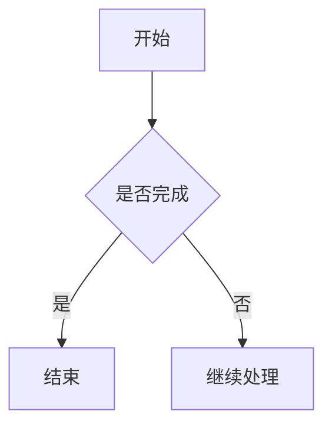
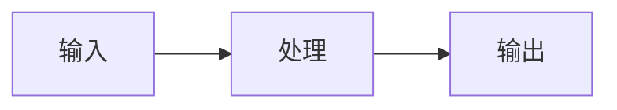

# 一、删除文件配置

在**设置 -> 文件与链接 -> 回收站**，有关于删除文件的配置。

![[Pasted image 20260707235047.png|500]]

主要有三个选项：

| 选项                      | 含义                        |
| ----------------------- | ------------------------- |
| 移至系统回收站                 | 删除后进入系统回收站，可以从系统回收站恢复     |
| 移至 Obsidian 回收站（.trash） | 删除后移动到当前仓库里的 `.trash` 文件夹 |
| 永久删除                    | 直接删除，不进回收站，风险最高           |
一般建议默认移至系统回收站，这样最符合普通文件删除习惯，也方便误删后恢复。

# 二、笔记别名

一篇笔记在不同语境中可能有不同名称，这些名称就是笔记别名。比如“人工智能”可以简称为“AI”，外文概念也可以用中文名、英文名或缩写共同指向同一篇笔记。

## 1. 设置别名

别名写在笔记开头的 YAML frontmatter 中，字段名必须使用英文 `aliases`。例如 人工智能 这篇笔记的顶部写：

```yaml
---
aliases: [AI, Artificial Intelligence]
---
```

Frontmatter 必须放在整篇笔记最开头，否则 Obsidian 不会识别。

## 2. 使用别名链接

设置别名后，可以直接输入 `[[别名]]` 搜索并链接到原笔记。插入后，Obsidian 会自动生成带显示文本的链接：

```markdown
[[笔记原名称|别名]]
```

这样既能显示别名，又能明确指向原笔记。

## 3. 反向链接中的别名

设置别名后，其他笔记中提到原标题或别名的内容，都会出现在该笔记的“反向链接列表”中。

如下图所示，第一篇笔记 和 第二片笔记 内容分别出现了 AI 和 人工智能，它们都出现在当前 人工智能笔记的反向链接列表（即使只是普通文本还不是链接）。

![[Pasted image 20260708000914.png|600]]

点击“转为内部链接”后，对应笔记的普通文本会被替换为链接：


![[Pasted image 20260708001017.png|600]]

此时，第二篇笔记中的 AI 普通文本会变成链接：

```markdown
[[人工智能|AI]]
```

别名适合用于缩写、外文译名、昵称、旧称等场景，可以减少重复建笔记，也能让不同叫法统一指向同一个知识对象。

# 三、功能区

功能区用于展示一些常用命令。这些命令可能来自 Obsidian 默认功能、核心插件，也可能来自第三方插件。

在桌面端，功能区位于左侧边栏，即使左侧边栏关闭，功能区本身仍然可见。

![[Pasted image 20260708001558.png|200]]

功能区中的每个图标都代表一个命令。鼠标悬停在图标上会显示提示，点击图标即可执行对应命令。例如，点击关系图谱图标，就会打开关系图谱：

![[Pasted image 20260708001747.png|600]]

功能区顶部通常显示插件添加的命令，包括 Obsidian 核心插件和社区插件。功能区底部默认有三个基础命令：

| 命令     | 作用                  |
| ------ | ------------------- |
| 打开另一个库 | 切换或打开其他 Obsidian 仓库 |
| 帮助     | 访问 Obsidian 帮助文档    |
| 设置     | 打开 Obsidian 设置      |

功能区可以自定义，设置结果会保存到 `.obsidian/workspace.json` 文件中。如果同步该文件，不同设备上的功能区设置也会保持一致。

桌面端常用操作：

- 拖放图标，调整命令顺序。
- 右键点击功能区空白处，取消勾选不需要显示的命令。

# 四、标签

标签和你常在文章、视频网站看到的标签类似。具有同一标签的笔记，会被 Obsidian 记住并统一检索。

标签本质上是一个可点击的检索按钮。点击某个标签后，Obsidian 会自动搜索库中所有包含这个标签的笔记。例如，点击 `#标签`，就会显示所有带有这个标签的笔记。

标签可以用来标明笔记来源、笔记类型、主题分类，也可以作为连接笔记和想法的切入点。

## 1. 标签面板

如果启用了“标签列表”核心插件，侧边栏会显示当前库中所有标签，并按照使用频次排序。点击任意标签，即可搜索包含该标签的笔记。

![[Pasted image 20260708002753.png|500]]

## 2. 嵌套标签

嵌套标签使用 `/` 表示层级：

```markdown
#maintag/subtag
```

其中 `maintag` 是主标签，`subtag` 是子标签。开启“显示嵌套标签”后，标签面板会按层级展示这些标签。

![[Pasted image 20260708002916.png|600]]

嵌套标签也可以点击搜索。比如点击主标签 `#maintag`，可以找到这个主标签下包含任意子标签的笔记。

## 3. 标签命名规则

标签不能包含空格。如果需要区分多个词，可以使用以下写法：

| 写法 | 示例 |
| --- | --- |
| 驼峰式 | `#TwoWords` |
| 下划线 | `#two_words` |
| 破折号 | `#two-words` |

标签中可以使用 `_`、`-` 和用于嵌套标签的 `/`。标签也可以包含数字，但不能完全由数字组成，例如 `#1984` 不是合法标签。

# 五、标签页

Obsidian 的标签页和浏览器标签页很像，用来在同一个窗口里同时打开多篇笔记或多个功能页面。

常用操作也和浏览器接近，比如新建标签页、关闭当前标签页、撤销关闭的标签页、切换标签页等。这些快捷键都可以在 **设置 -> 快捷键** 中查看和修改。

![[Pasted image 20260708003440.png|600]]

Obsidian 中，每个标签页都属于一个标签组。你可以拖动标签页来调整顺序，也可以把标签页拖到另一个标签组中。如下图所示，因为拖放，现在有两个标签组。

![[Pasted image 20260708004235.png|600]]

如果把标签页拖到当前标签组的边缘，Obsidian 会高亮显示可放置区域。松开后，就可以把当前区域拆分成左右或上下两个标签组。

在桌面端，可以把标签页拖出当前窗口，让它在新窗口中打开。也可以把标签页拖到另一个已有窗口中。

右键点击标签页，可以选择“锁定”。锁定后，这个标签页中的链接会在新标签页中打开，不会直接替换当前页面。

如果想取消锁定，再次右键点击标签页，选择“取消锁定”即可。

标签组也可以切换为“堆叠标签页”显示方式。点击标签组右上角的下拉按钮，选择“堆叠标签页”即可。

![[Pasted image 20260708004316.png|600]]

当同一个标签组里打开了很多笔记时，堆叠标签页可以减少横向空间占用，让工作区更紧凑。

# 六、文件恢复功能

首先，需要在 **设置 -> 核心插件 -> 文件恢复** 中打开这个功能，默认是开启的。

文件恢复会定期保存笔记快照，用来防止意外数据丢失。比如误删了一段内容、笔记被错误覆盖，或者想找回某个旧版本时，就可以从快照中恢复。

默认情况下，Obsidian 至少每隔 5 分钟保存一次快照，并保留 7 天。你也可以在 **设置 -> 文件恢复** 中修改保存间隔和保留天数。

需要注意的是，快照不会一直保存。为了避免占用太多空间，Obsidian 会在超过保留天数后删除旧快照。

文件恢复的快照保存在系统目录中，而不是当前仓库里。这样即使仓库本身出问题，也仍然有机会找回内容。但如果你最近移动过仓库位置，可能需要把仓库移回当时的位置，才能找到对应快照。

恢复快照的步骤：

1. 打开 Obsidian 设置。
2. 在左侧找到“文件恢复”。
3. 在“快照”旁点击“查看”。
4. 搜索要恢复的文件名。
5. 选择对应快照。
6. 点击“复制到剪贴板”。
7. 将内容粘贴回原笔记，或粘贴到新笔记中进行对比。

如果要清空快照历史，可以在“文件恢复”中点击“清除历史”。但这会永久删除所有快照，无法撤销，通常不建议随意操作。

# 七、脑图和流程图

不需要任何设置，Obsidian 天然支持 Mermaid 语法，可以直接在笔记中画流程图、时序图、甘特图、饼图等。如果需要更复杂的脑图体验，也可以另外安装脑图类插件。

Mermaid 的写法是使用 `mermaid` 代码块：

````markdown

````


其中 `graph TD` 表示从上到下绘制流程图。如果想横向展示，可以改成 `graph LR`：

````markdown

````


常见方向：

| 写法 | 含义 |
| --- | --- |
| `graph TD` | 从上到下 |
| `graph LR` | 从左到右 |

Mermaid 不只适合画流程图，也可以画：

| 类型 | 适合场景 |
| --- | --- |
| 流程图 | 步骤、判断、分支流程 |
| 时序图 | 角色之间的交互顺序 |
| 甘特图 | 项目计划和时间安排 |
| 饼图 | 简单比例关系 |
| 类图 | 对象、类型、继承关系 |

对日常笔记来说，最常用的是流程图。只要记住节点、箭头和方向即可，不需要一开始掌握所有 Mermaid 语法。
